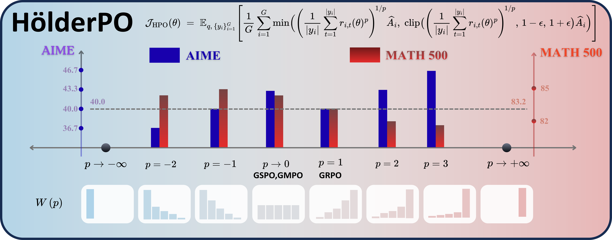

<h1 align="center">Hölder Policy Optimization</h1>

<p align="center">
  <em><strong>Hölder Policy Optimization</strong> replaces the fixed aggregation
  of token-level importance sampling ratios in GRPO with the adaptable Hölder
  mean (<i>p</i>-norm). Modulating a dynamic <i>p</i> ∈ ℝ interpolates between
  sequence-level stability and token-level exploration.</em>
</p>

<p align="center">
  <a href="LICENSE"></a>
  <a href="https://github.com/sail-sg/oat"></a>
  <a href="../../tree/agentic"></a>
</p>

<p align="center"></p>

---

## Setup

```bash
conda create -n holder python==3.10
conda activate holder
pip install vllm==0.8.4 && pip install oat-llm==0.1.3.post1
cd understand_r1_zero_main && pip install -e . && cd ..
```

Weights & Biases is opt-in: `export WANDB_API_KEY=...` and set `USE_WB=1` when
launching the script.

## Train

```bash
bash scripts/qwen2.5-math-7b-holder.sh
```

Knobs:

| variable                  | meaning                                       |
|---------------------------|-----------------------------------------------|
| `HOLDER_P`                | constant $p$ (used when schedule is constant) |
| `HOLDER_P_SCHEDULE`       | one of the schedules in [The loss](#the-loss) |
| `HOLDER_P_MIN` / `_MAX`   | schedule bounds                               |
| `HOLDER_P_SCHEDULE_STEPS` | steps the schedule spans                      |
| `HOLDER_P_POWER`          | exponent for `quad` / `quad_dec`              |
| `CLIPRANGE`               | PPO-style clip                                |
| `MODEL_NAME`              | base policy                                   |
| `N_GPU` / `N_SAMPLE`      | parallelism / responses per prompt            |

## Evaluate

Edit the `model=...` path in `scripts/eval.sh`, then:

```bash
bash scripts/eval.sh
```

Default suite (under `datasets/evaluation_suite_v2/`): AIME24, AIME25, AMC,
MATH500, Minerva, OlympiadBench.

## The loss

HölderPO aggregates per-token importance ratios with a Hölder *p*-mean along the
sequence and feeds the result into a PPO-style clipped surrogate. The variant
controls whether aggregation is sequence-level or token-level; the schedule
controls how *p* evolves over training.

**Variants** (`--critic_type_modify`):

| value          | aggregation                                       |
|----------------|---------------------------------------------------|
| `holder`       | sequence-level Hölder *p*-mean over token ratios  |
| `holder_token` | token-level Hölder *p*-mean                       |

**Schedules** (`--holder_p_schedule`):

| schedule                | behaviour                                          |
|-------------------------|----------------------------------------------------|
| `constant`              | fixed *p*                                          |
| `linear` / `linear_dec` | linear ramp up / down                              |
| `sin` / `cos`           | sinusoidal ramp                                    |
| `quad` / `quad_dec`     | polynomial of order `holder_p_power`               |
| `cubic` / `cubic_dec`   | cubic ramp                                         |

## Layout

```
.
├── train_zero_math_holder.py       # oat PPOLearner subclass — Hölder / Hölder-token loss
├── scripts/
│   ├── qwen2.5-math-7b-holder.sh   # training launcher
│   └── eval.sh                     # offline eval
├── utils/evaluation/               # vLLM-based evaluator + maths grader
├── datasets/evaluation_suite{,_v2}/  # eval prompts
├── understand_r1_zero_main/        # vendored maths grader & data loader
└── assets/                         # figures
```

## Agent / ALFWorld experiments

The agent-side experiments live on the
[`agentic`](../../tree/agentic) branch under
[`alfworld/`](../../tree/agentic/alfworld) — same Hölder loss, layered on top
of [`verl-agent`](https://github.com/langfengQ/verl-agent). See
[`alfworld/HOLDER.md`](../../tree/agentic/alfworld/HOLDER.md) on that branch
for setup and entry points.

## Acknowledgements

This codebase builds on [`oat`](https://github.com/sail-sg/oat) (maths RL stack)
and the [`understand-r1-zero`](https://github.com/sail-sg/understand-r1-zero)
maths grader / data pipeline. The agent variant on the
[`agentic`](../../tree/agentic) branch forks
[`verl-agent`](https://github.com/langfengQ/verl-agent).

## License

Apache-2.0 (see `LICENSE`). Vendored `understand_r1_zero_main/` retains its
upstream Apache-2.0 licence.
